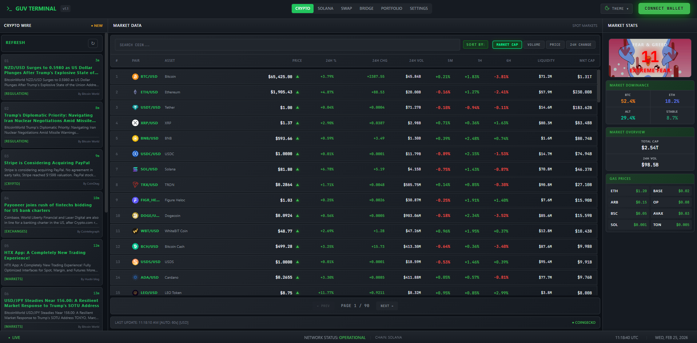

# GUV Terminal

A cryptocurrency terminal dashboard with real-time market data, portfolio tracking, token swapping, and cross-chain bridging.


## Features

- **Multi-Chain Dashboard** - Track crypto markets across Ethereum, Solana, and L2s
- **Real-Time Prices** - Live price data with multiple API providers (CoinGecko, CoinMarketCap, CryptoCompare)
- **Solana Dashboard** - 100+ Solana tokens via multi-endpoint DexScreener
- **Token Metadata** - Automatic token images from Solana token list
- **Wallet Connection** - Phantom & Solflare for Solana
- **Token Swap** - Jupiter aggregator for best DEX rates
- **Portfolio Tracking** - View your wallet balances and token holdings
- **Cross-Chain Bridge** - Transfer tokens between chains via Relay Protocol
- **News Feeds** - Separate CRYPTO WIRE (all crypto) and SOLANA WIRE (Solana-only)
- **Multiple Themes** - Dark, Light, Midnight, Neon modes
- **Responsive Design** - Desktop and mobile support

## Quick Start

```bash
# Clone the repository
git clone https://github.com/0xguv/GUV-TERMINAL.git
cd GUV-TERMINAL

# Install dependencies
npm install

# Start development server
npm start
```

The app runs on `http://localhost:3002` with backend on `http://localhost:3001`.

## Configuration

### API Keys (Optional)

Create a `.env` file in the root directory:

```env
# CoinMarketCap API Key (optional - uses CoinGecko free tier if not set)
CMC_API_KEY=your_coinmarketcap_api_key

# Jupiter API Key (for swap functionality)
REACT_APP_JUPITER_API_KEY=your_jupiter_api_key

# Helius RPC (for Solana wallet connection)
REACT_APP_HELIUS_API_KEY=your_helius_api_key
```

Get free API keys:
- [CoinMarketCap](https://pro.coinmarketcap.com/signup)
- [Jupiter](https://station.jup.ag/docs/apis/self-hosted-api)
- [Helius](https://www.helius.dev/)

The app works without API keys using free tier providers (CoinGecko).

### Available Scripts

| Command | Description |
|---------|-------------|
| `npm start` | Start dev server (frontend + backend) |
| `npm run server` | Start backend only |
| `npm run build` | Create production build |

## Dashboard Tabs

| Tab | Description |
|-----|-------------|
| CRYPTO | Top 100 cryptocurrencies (CoinGecko) |
| SOLANA | 100+ Solana ecosystem tokens (DexScreener) |
| SWAP | Jupiter token swap |
| BRIDGE | Cross-chain bridging |
| PORTFOLIO | Wallet holdings |
| NEWS | CRYPTO WIRE / SOLANA WIRE |

## News Feeds

- **CRYPTO WIRE** - All crypto news (excludes Solana)
- **SOLANA WIRE** - Solana-specific news only

Powered by CryptoCompare API with real-time filtering.

## Tech Stack

- **Frontend**: React 18, Recharts, Lucide Icons
- **Blockchain**: Solana Web3.js, Wallet Adapter
- **Data**: CoinGecko, CoinMarketCap, CryptoCompare, DexScreener, Jupiter API
- **Backend**: Express.js (API proxy)

## Project Structure

```
src/
├── components/       # React components
│   ├── Terminal.js      # Main dashboard
│   ├── CryptoDashboard.js
│   ├── SolanaDashboard.js
│   ├── JupiterSwap.js
│   ├── Bridge.js
│   ├── PortfolioTracker.js
│   └── ...
├── contexts/         # React contexts
├── hooks/           # Custom hooks
├── utils/           # Utilities
server.js            # Express backend
```

## Security

- Never commit `.env` files (already gitignored)
- API keys stored in localStorage for frontend, environment variables for backend
- Input validation on all user inputs
- Wallet private keys never exposed

## License

MIT License - see [LICENSE](LICENSE) file.

## Disclaimer

Cryptocurrency trading involves risk. This software is for informational purposes only. Do your own research before making investment decisions.

---

**Built for the crypto community**
